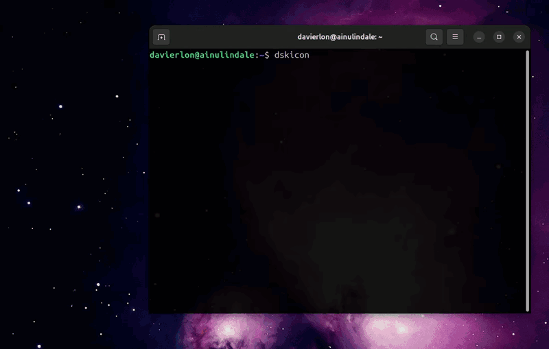

# DSKICON

dskicon é uma aplicação escrita em Go que permite buscar ícones do sistema (arquivos .desktop) e adicioná-los automaticamente à Área de Trabalho no Ubuntu de forma simples e intuitiva.

A aplicação utiliza uma interface interativa baseada em terminal construída com a biblioteca PromptUI.

---

## Sobre a biblioteca PromptUI

Este projeto utiliza a biblioteca PromptUI:
https://github.com/manifoldco/promptui

PromptUI é distribuída sob a licença BSD-3-Clause, uma licença permissiva que permite uso, modificação e redistribuição.
Certifique-se de consultar o repositório oficial para detalhes completos sobre a licença.

---

## Funcionalidades

- Busca interativa por arquivos .desktop disponíveis no sistema.
- Interface intuitiva via terminal.
- Cópia automática do arquivo selecionado para a Área de Trabalho.
- Ajuste automático de permissões para permitir execução via interface gráfica.

A aplicação executa um comando para garantir que o arquivo .desktop copiado tenha permissão de execução via gio (GNOME Imput/Output).
Isso é necessário no Ubuntu para evitar erros ao tentar abrir o atalho pela interface gráfica.

Observação:

Alguns ambientes Linux podem ter políticas de segurança diferentes.
Em distribuições que utilizam mecanismos adicionais de controle (como SELinux ou outras políticas de execução), pode ser necessário configurar permissões manualmente.

---

## Instalação

Certifique-se de ter o Go 1.20 ou superior instalado.

Instale diretamente com:

```bash
go install github.com/DaviErlon/dskicon@latest
```

Após a instalação, certifique-se de que o diretório \$GOPATH/bin (ou \$GOBIN) esteja no seu PATH.

---

## Uso

Execute o programa chamando:

```bash
dskicon
```
A interface exigirá que configure os diretórios na primeira execução (será possível alterar esses diretórios posteriormente).

Em seguida, o programa exibirá uma lista interativa permitindo:
1. Buscar e selecionar o ícone desejado para a área de trabalho com as permissões corretas.
2. Configurar os diretórios da aréa de trabalho e/ou diretórios de buscas para os arquivos .desktop.
3. Finalizar o programa.

---

## Estrutura do Projeto

- `main.go`  
  - Ponto de entrada da aplicação

- `util/`  
  - Manipulação dos arquivos .desktop

- `ui/`  
  - Interface interativa via terminal

- `go.mod`  
  - Definição do módulo

- `go.sum`  
  - Controle de integridade das dependências

---

## Demonstração



---

## Licença

Este projeto está licenciado sob a **Licença MIT**.  
Isso significa que você pode usar, copiar, modificar e distribuir este software livremente, inclusive para fins comerciais, desde que mantenha o aviso de copyright e a licença original no código.

Para mais detalhes, consulte o arquivo `LICENSE`.


## Autor

Desenvolvido por Davi.
